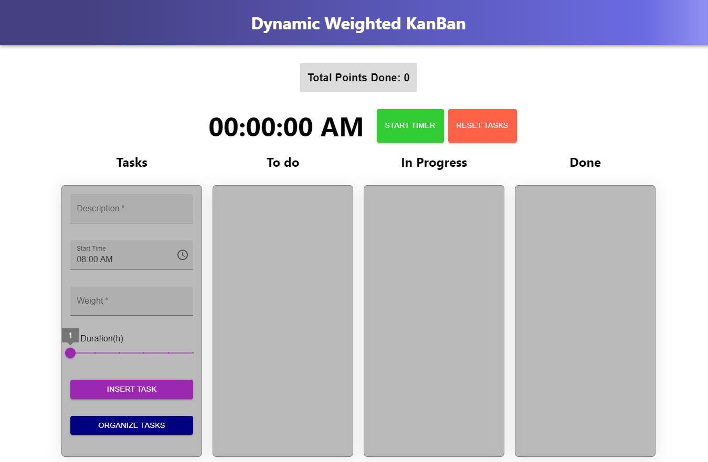
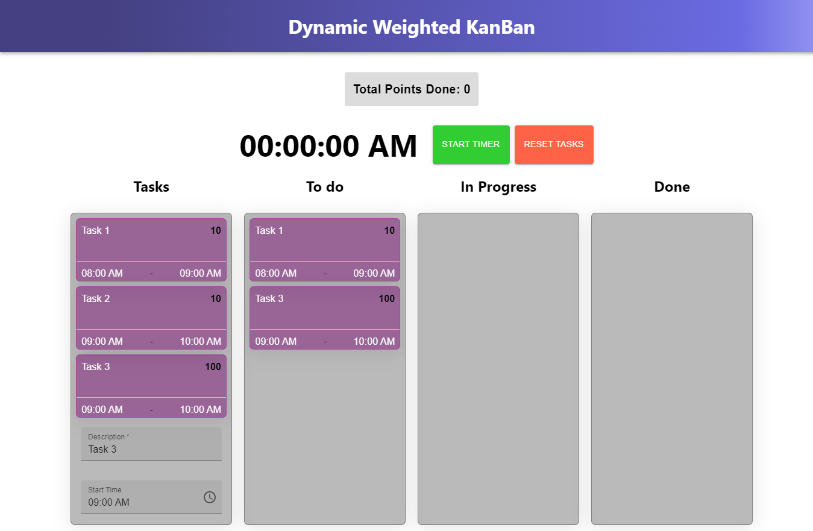
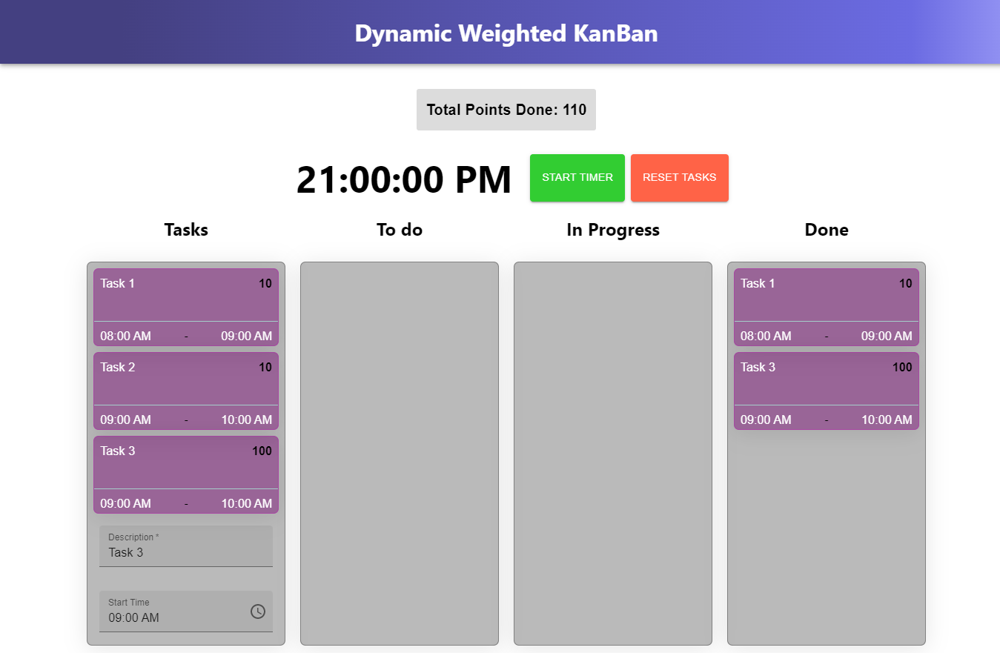

# Dynamic Weighted Kanban

**Número da Lista**: 5<br>
**Conteúdo da Disciplina**: Programação Dinâmica<br>

## Alunos
|Matrícula | Aluno |
| -- | -- |
| 19/0044799  |  Antônio Ferreira de Castro Neto |
| 18/0125885  |  Lucas Melo dos Santos |

## Sobre 
O Dynamic Weithed Kanban é um projeto baseado no Greedy Kanban, outro projeto realizado por nós no módulo 3. Diferente do Greedy Kanban, o Dynamic Kanban leva em conta os pesos das tarefas na sua solução, de forma que a combinação final atinga o maior somatório de peso. Esse somatório é incrementado ao finalizar uma tarefa, e é mostrado na tela a pontuação total. Para isso, utilizamos a **Programação Dinâmica** e o algortimo *Weighted Interval Schedulling*.

A aplicação também gera uma animação com as tarefas e um cronômetro simulando o tempo. As atividades vão progredindo, de acordo com sua duração, da coluna "To Do" até a coluna "Done" do Kanban. A animação é mostrada no vídeo de apresentação.

## Screenshots
## Tela Inicial

## Solução com maior peso

## Pontuação total


## Instalação 
**Linguagem**: JavaScript<br>
**Framework**: React<br>
**Pré-requisitos:**
* ter instalado na máquina **yarn** ou **npm**.
* Preferêncialmente rodar o projeto num ambiente Linux.

## Uso 
* Após clonar o repositório em sua máquina:

```
cd PD_DynamicKanBan
cd pd-kanban

yarn install

yarn start
```
ou 
```
cd PD_DynamicKanBan
cd pd-kanban

npm install

npm start
```

* Para cadastrar uma atividade, adicione uma descrição, horário de início, **peso** e duração e clique no botão *insert Task*.
* Para ordenar as atividades, clique em *organize tasks*.
* Clique em *Start Timer* para iniciar a animação e em *Reset Tasks* para resetar as atividades.


